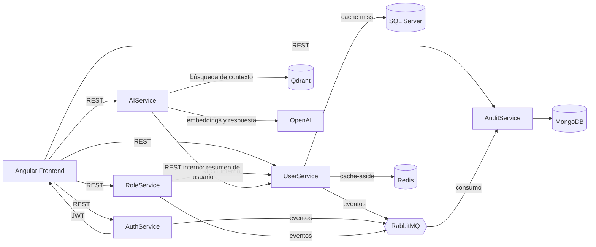

# Arquitectura de IdentityHub

IdentityHub está organizado como un conjunto de microservicios. Cada servicio tiene su propia API y lógica de aplicación. Las comunicaciones síncronas se realizan por REST y los eventos de auditoría se publican de forma asíncrona por RabbitMQ.

## Diagrama

UserService usa Redis como caché distribuida para `GET /api/users/{id}`. SQL Server sigue siendo la fuente de verdad cuando hay un cache miss o Redis no está disponible.

## Decisiones técnicas

- **SQL Server:** se usa para datos transaccionales como usuarios, credenciales y roles.
- **MongoDB:** se usa para auditoría porque los eventos se almacenan como documentos y pueden tener metadata diferente.
- **Redis:** reduce consultas repetidas mediante el patrón `cache-aside`, con un TTL de cinco minutos.
- **RabbitMQ:** envía eventos de forma asíncrona y evita que los servicios dependan directamente de AuditService.
- **JWT:** AuthService genera los tokens y los demás servicios pueden validarlos de forma independiente.
- **Qdrant:** almacena embeddings y permite encontrar contexto relevante para RAG.
- **OpenAI:** genera embeddings y respuestas basadas en el contexto recuperado.
- **Clean Architecture:** separa `Domain`, `Application`, `Infrastructure` y `API` para reducir el acoplamiento.
- **DDD:** mantiene las reglas principales del negocio dentro del dominio.

## Flujos principales

### Login

Angular envía email y password a AuthService. AuthService valida las credenciales y devuelve un JWT que el frontend usa en las siguientes solicitudes.

### Asignación de rol

Angular llama a RoleService. RoleService valida que el usuario exista y esté activo consultando UserService, valida el rol y guarda la asignación.

### Auditoría

UserService, AuthService y RoleService publican eventos en RabbitMQ. AuditService los consume y los guarda en MongoDB junto con su `CorrelationId`.

### Datos de usuario

UserService busca primero en Redis. Si no encuentra el usuario o Redis falla, consulta SQL Server y guarda el resultado en caché cuando es posible.

### RAG

La pregunta se convierte en un embedding. Qdrant busca los fragmentos más relacionados y AIService envía la pregunta junto con ese contexto a OpenAI para generar la respuesta.

### Resumen de usuario con AI

AIService consulta `GET /internal/users/{id}` en UserService usando `X-Internal-Api-Key`. Para `GET /api/ai/users/{userId}/summary` solo envía a OpenAI el identificador, email y estado activo del usuario.
